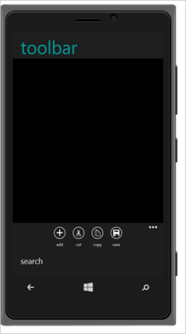

## Windows phone specific toolbar

In windows phone mode, when the number of toolbar items is more than 4, then the remaining items is rendered inside a menu container. And an overflow icon is added with toolbar to display the menu container.

Refer to the following code example.

@Html.EJMobile().Toolbar("toolbar_sample").RenderMode(RenderMode.Windows).Items(items =>

   {

       items.Add().IconName(IconName.Add);

       items.Add().IconName(IconName.Cut); 

       items.Add().IconName(IconName.Copy);

       items.Add().IconName(IconName.Save);

       items.Add().IconName(IconName.Search);

   })

 The following screenshot illustrates the output of the above code.

{  | markdownify }
{:.image }

